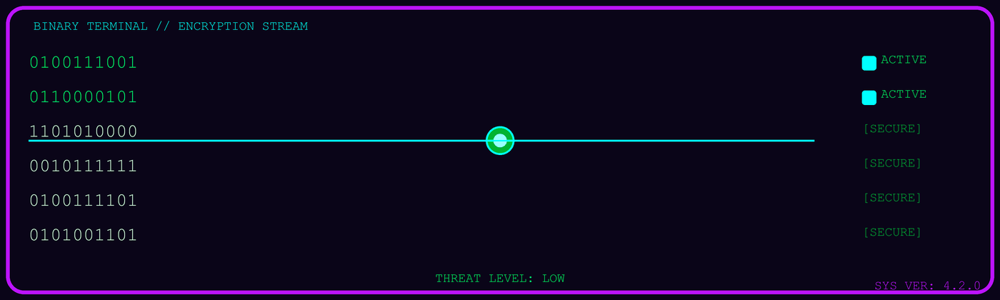

<p align="center">
  
</p>

<p align="center">
  
</p>

<p align="center">
  <b>Cyber Security Undergraduate @ SLIIT · Year 3 · Linux · Networking · Python Automation · Defensive Security</b>
</p>

<p align="center">
  
</p>

<p align="center">
  <a href="https://owasp.org/">
    
  </a>

  <a href="https://www.linuxfoundation.org/">
    
  </a>

  <a href="https://www.netacad.com/">
    
  </a>

  <a href="https://www.python.org/">
    
  </a>

  <a href="https://attack.mitre.org/">
    
  </a>
</p>
---

## 💫 About Me

- 🐧 Linux & System Administration enthusiast
- 🌐 Focused on Network Security and Security Operations
- 🧠 Strengthening Penetration Testing and Secure Infrastructure skills
- ⚙️ Building Python automation for practical security and IT tasks
- 🎯 Aiming to grow into a strong cybersecurity professional

---

## 🔥 Project Arsenal

<p align="center">
  
  
  
  
</p>

<p align="center">
  <sub>building tools, labs, and defensive workflows</sub>
</p>

---

## 🖥️ SOC TERMINAL

```bash
root@security-console:~$

identity      : Cyber Security Undergraduate
focus         : Linux | Networking | Python
mode          : Defensive Security
threat_level  : LOW
target_role   : Security Engineer
```

---

## 🚀 Skill Pipeline


---

## 📡 Active Focus

<p align="center">
  
  
  
  
</p>

```text
[OK] linux hardening
[OK] packet analysis
[OK] automation scripts
[... ] detection engineering
[... ] cloud security
```

---

<!--
## 🔐 Security Posture

<details open>
<summary><b>Profile snapshot</b></summary>

- Focused on Linux, networking, and Python automation
- Building toward defensive security and security operations
- Aiming for stronger penetration testing and secure infrastructure skills
- Working on projects that show real technical growth

</details>

<details>
<summary><b>What I am sharpening right now</b></summary>

- Linux administration
- Network security fundamentals
- Python tooling for security and automation
- Penetration testing basics
- Secure infrastructure concepts

</details>
-->

<!--
## 🧠 Threat Model

> asset
skills + projects + consistency

> main_attack_surface
lack of real-world repos

> defense_strategy
ship projects, document them, keep building

> objective
become stronger in security engineering
-->

<!--
## 🎯 Current Mission Log

```text
> identity
niduwara-j

> mode
defensive security

> current_stack
Linux | Networking | Python Automation

> current_learning
Penetration Testing
Linux Administration
Secure Infrastructure

> target_role
Security Engineer
```
-->

---

## 🚀 Learning Roadmap

- [x] Networking Fundamentals
- [x] Linux Fundamentals
- [x] Python Programming
- [ ] Docker & Containers
- [ ] Penetration Testing
- [ ] Security Monitoring
- [ ] Cloud Security

---
## 🛠️ Ops Stack

<p align="center">
  <a href="https://www.c-language.org/">
    
  </a>

  <a href="https://www.python.org/">
    
  </a>

  <a href="https://openjdk.org/">
    
  </a>

  <a href="https://www.gnu.org/software/bash/">
    
  </a>

  <a href="https://developer.mozilla.org/en-US/docs/Web/JavaScript">
    
  </a>

  <a href="https://www.mysql.com/">
    
  </a>

  <a href="https://git-scm.com/">
    
  </a>

  <a href="https://github.com/">
    
  </a>

  <a href="https://www.cisco.com/">
    
  </a>
</p>

## 📊 Live Telemetry

```yaml
linux:
  status: active

networking:
  status: active

python_automation:
  status: building

security_operations:
  status: monitoring

threat_level:
  value: low

target:
  role: security_engineer
```
<!--
<p align="center">
  
</p>
-->
---

## 🌐 Connect With Me

<p align="center">
  <a href="https://www.linkedin.com/in/niduwara-jayasiri/">
    
  </a>
</p>

---

## 🐍 Contribution Snake

<p align="center">
  
</p>

---

## 🖥️ Security Operations Feed

<p align="center">
  
</p>

<br>

<!--
## 📂 Project Arsenal

<p align="center">
  
  
  
  
</p>

<p align="center">
  <sub>building tools, labs, and defensive workflows</sub>
</p>
-->

<p align="center">
  
</p>
