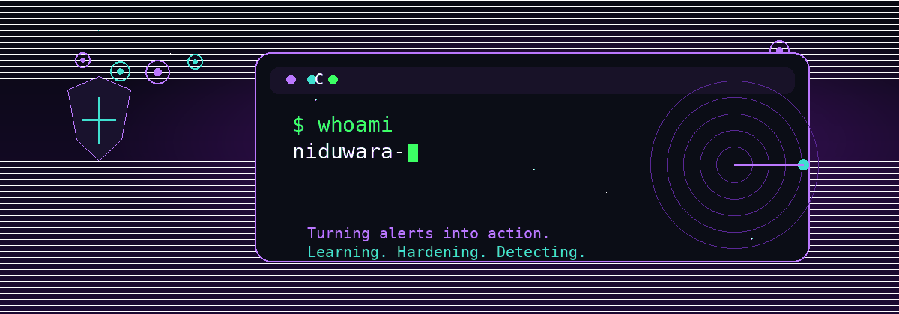

<p align="center">
  
</p>

<p align="center">
  
</p>

<p align="center">
  
</p>

<p align="center">
  
  
  
  
  
</p>

---

<p align="center">
  
</p>

```bash
$ whoami
niduwara-j

$ role
Cyber Security Undergraduate

$ current_focus
Linux
Networking
Python Automation

$ mission
Build secure, scalable, and resilient systems

$ next_target
Security Engineer
```

---

## 🔐 Profile Snapshot

<details open>
<summary><b>Security posture</b></summary>

- **Identity:** Cyber Security Undergraduate
- **Focus:** Linux, networking, Python automation
- **Direction:** defensive security, hardening, monitoring, threat analysis
- **Target:** security engineering

</details>

<details>
<summary><b>What I am sharpening right now</b></summary>

- Linux administration
- Network security fundamentals
- Python tooling for security and automation
- Penetration testing basics
- Secure infrastructure concepts

</details>

---

## 🧠 Threat Model

```text
> asset
skills + projects + consistency

> main_attack_surface
lack of real-world repos

> defense_strategy
ship projects, document them, keep building

> objective
become stronger in security engineering
```

---

## 🚀 Skill Pipeline

<p align="center">
  
  
  
  
  
  
  
  
  
  
  
  
  
</p>

## 📡 Active Focus

<p align="center">
  
</p>

| Area | Status | Next Move |
|---|---:|---|
| Linux Administration | Learning | Hardening + scripting |
| Networking | Strong foundation | Lab practice |
| Python Automation | Building | Security tools |
| Penetration Testing | Exploring | Controlled labs |
| Security Monitoring | Next | Logs + alerting |
| Cloud Security | Next | Infrastructure basics |

---

## 🎯 Current Mission Log

```text
> identity
niduwara-j

> mode
defensive security

> current_stack
Linux | Networking | Python Automation

> current_learning
Penetration Testing
Linux Administration
Secure Infrastructure

> target_role
Security Engineer
```

---

## 🚀 Learning Roadmap

- [x] Networking Fundamentals
- [x] Linux Fundamentals
- [x] Python Programming
- [ ] Docker & Containers
- [ ] Penetration Testing
- [ ] Security Monitoring
- [ ] Cloud Security

---

## 🛠️ Ops Stack

<p align="center">
  
  
  
  
  
  
  
  
  
</p>

---

## 📊 Live Telemetry

<p align="center">
  
  
</p>

<p align="center">
  
</p>

<p align="center">
  
</p>

---

## 🌐 Connect With Me

<p align="center">
  <a href="https://www.linkedin.com/in/niduwara-jayasiri-2169a33ab/">
    
  </a>
</p>

---

## 📂 Featured Projects

<p align="center">
  
</p>

🚧 Building my cybersecurity and automation portfolio.

Soon to include:
- Linux hardening scripts
- Networking labs
- Python security tools
- Small defensive security projects

---

## 🧩 Binary Note

```text
01001110 01100101 01110100 01110111 01101111 01110010 01101011 00100000 01100011 01101111 01101110 01110100 01110010 01101111 01101100
```

---

<p align="center">
  
</p>
